# BizRadar AI - Probabilidade de Sucesso de Negócios

## 📋 Sobre o Projeto

O **BizRadar AI** é uma plataforma de **Inteligência Artificial** que revoluciona a análise de viabilidade comercial através de:

- **🤖 Assistente IA Conversacional**: ChatGPT integrado para consultas inteligentes
- **📸 Análise Visual**: Computer Vision para análise de fotos de localizações
- **🌐 Comparativo Multi-Cidade**: Análise simultânea de 10+ cidades brasileiras
- **🤝 Marketplace de Oportunidades**: Conecta investidores com oportunidades validadas
- **🔮 Predições com ML**: TensorFlow para análise preditiva e cenários futuros
- **📊 Dashboard Executivo**: Business Intelligence com KPIs e insights estratégicos
- **🏆 Algoritmos Proprietários**: CRI, PCS e 6+ fatores de análise avançada
- **🗺️ Geointeligência**: Integração com 5 APIs para dados precisos e atualizados

## 🎯 Fluxo de Análise 

### 📊 **Fluxo Tradicional (v1.0)**

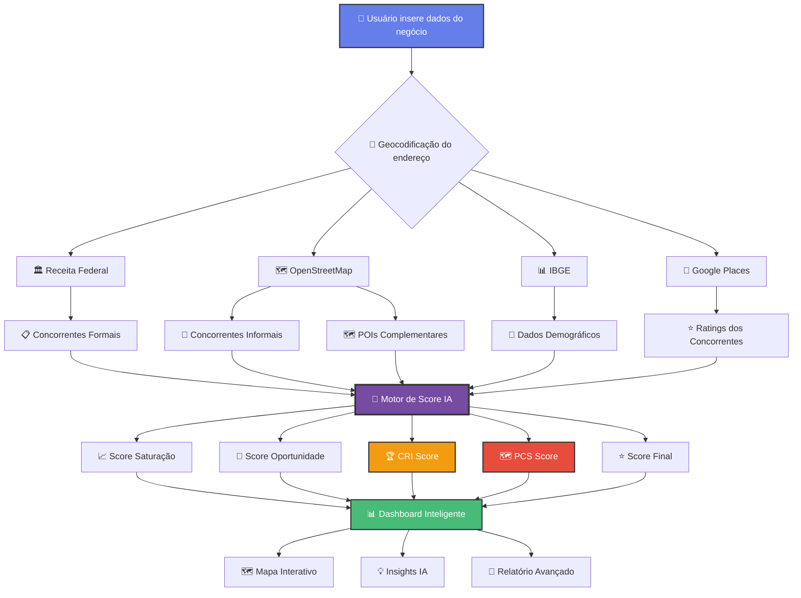

### 🤖 **Fluxo com IA Avançada (v2.0 - Atual)**

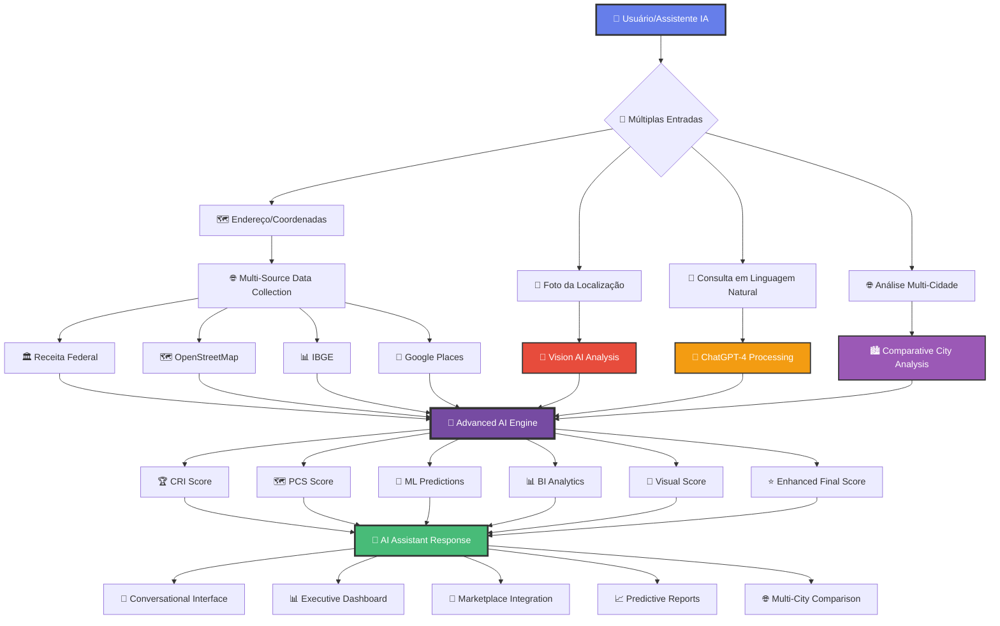

### 🔄 **Evolução do Sistema**

| Aspecto | v1.0 (Tradicional) | v2.0 (IA Avançada) |
|---------|-------------------|-------------------|
| **Entrada** | 📝 Formulário manual | 💬 Linguagem natural + 📸 Fotos |
| **Processamento** | 🧮 Algoritmos determinísticos | 🤖 IA + ML + Computer Vision |
| **Análise** | 🏙️ Cidade única | 🌐 Multi-cidade comparativa |
| **Saída** | 📊 Dashboard estático | 💬 Interface conversacional |
| **Predições** | ❌ Não disponível | 🔮 ML com cenários futuros |
| **Marketplace** | ❌ Não disponível | 🤝 Conecta investidores |
| **Interação** | 🖱️ Cliques e formulários | 💬 Chat inteligente |

## 🚀 Funcionalidades

### 🤖 **Assistente IA Conversacional**
- **ChatGPT-4 Integrado**: Consultas em linguagem natural
- **Contexto Inteligente**: Baseado no histórico do usuário
- **7 Tipos de Query**: Análise, estratégia, localização, scores, etc.
- **Respostas Estruturadas**: Insights acionáveis e próximos passos
- **Análise de Sentimento**: Para métricas de satisfação

### 📸 **Análise Visual com IA**
- **Computer Vision**: OpenAI Vision API para análise de fotos
- **Score Visual**: 0-100 baseado em elementos da imagem
- **Detecção Automática**: Estabelecimentos, fluxo, infraestrutura
- **Comparação Múltipla**: Análise simultânea de várias localizações
- **Insights Visuais**: Oportunidades e riscos identificados

### 🌐 **Análise Multi-Cidade**
- **10+ Cidades**: São Paulo, Rio, BH, Salvador, Brasília, etc.
- **Comparativo Inteligente**: Ranking baseado em múltiplos fatores
- **ROI por Região**: Cálculo de retorno e payback por cidade
- **Cenários de Risco**: Otimista, realista e pessimista
- **Recomendações Estratégicas**: Baseadas em dados regionais

### 🤝 **Marketplace de Oportunidades**
- **4 Categorias**: Premium, Oportunidade, Baixo Custo, Emergente
- **Matching Inteligente**: Baseado no perfil do investidor
- **Sistema de Interesse**: Conexão entre investidores e oportunidades
- **Filtros Avançados**: Por localização, investimento, score, ROI
- **Estatísticas em Tempo Real**: Métricas do marketplace

### 🔮 **Análise Preditiva com ML**
- **TensorFlow.js**: Rede neural para predições de sucesso
- **Análise Sazonal**: Padrões por tipo de negócio e região
- **Tendências de Mercado**: Projeções de 5 anos
- **Cenários de Risco**: Múltiplos cenários probabilísticos
- **Recomendações Temporais**: Melhor época para abertura

### 📊 **Dashboard Executivo com BI**
- **KPIs em Tempo Real**: 15+ métricas de performance
- **Análise de Tendências**: Gráficos temporais e sazonais
- **Segmentação Avançada**: Por tipo de negócio e região
- **Alertas Inteligentes**: Notificações automáticas de oportunidades
- **Relatórios Estratégicos**: Insights para tomada de decisão

### 🔍 **Análise Tradicional Aprimorada**
- **5 APIs Integradas**: Receita Federal, IBGE, OpenStreetMap, Google Places, Nominatim
- **Motor de IA**: 6 algoritmos ponderados com machine learning
- **CRI (Competitor Rating Index)**: Análise de qualidade dos concorrentes
- **PCS (POI Complementarity Score)**: Sinergia com pontos de interesse
- **Análise de Saturação**: Densidade de mercado vs. população
- **Mapeamento 360°**: Concorrentes formais, informais e ratings

### 🗺️ Visualização Geoespacial
- **Mapa Inteligente**: Leaflet/Mapbox com camadas dinâmicas
- **Heatmap Avançado**: Concorrência + ratings + POIs
- **Análise de Mobilidade**: Transporte público, acessibilidade
- **Sinergia Visual**: POIs complementares destacados
- **Sugestões IA**: Localizações alternativas otimizadas

### 📊 Dashboard e Relatórios
- **Dashboard IA**: Estatísticas em tempo real com insights inteligentes
- **Análise Temporal**: Histórico com tendências e padrões
- **Relatórios Avançados**: PDF/JSON com CRI e PCS detalhados
- **Insights Personalizados**: Recomendações baseadas em 10+ fatores
- **Alertas Inteligentes**: Notificações sobre mudanças no mercado

### 👥 Sistema de Usuários
- Autenticação JWT
- Planos de assinatura (Individual, PRO, Enterprise)
- Perfil de usuário e preferências
- Controle de limites por plano

## 🛠️ Tecnologias Utilizadas

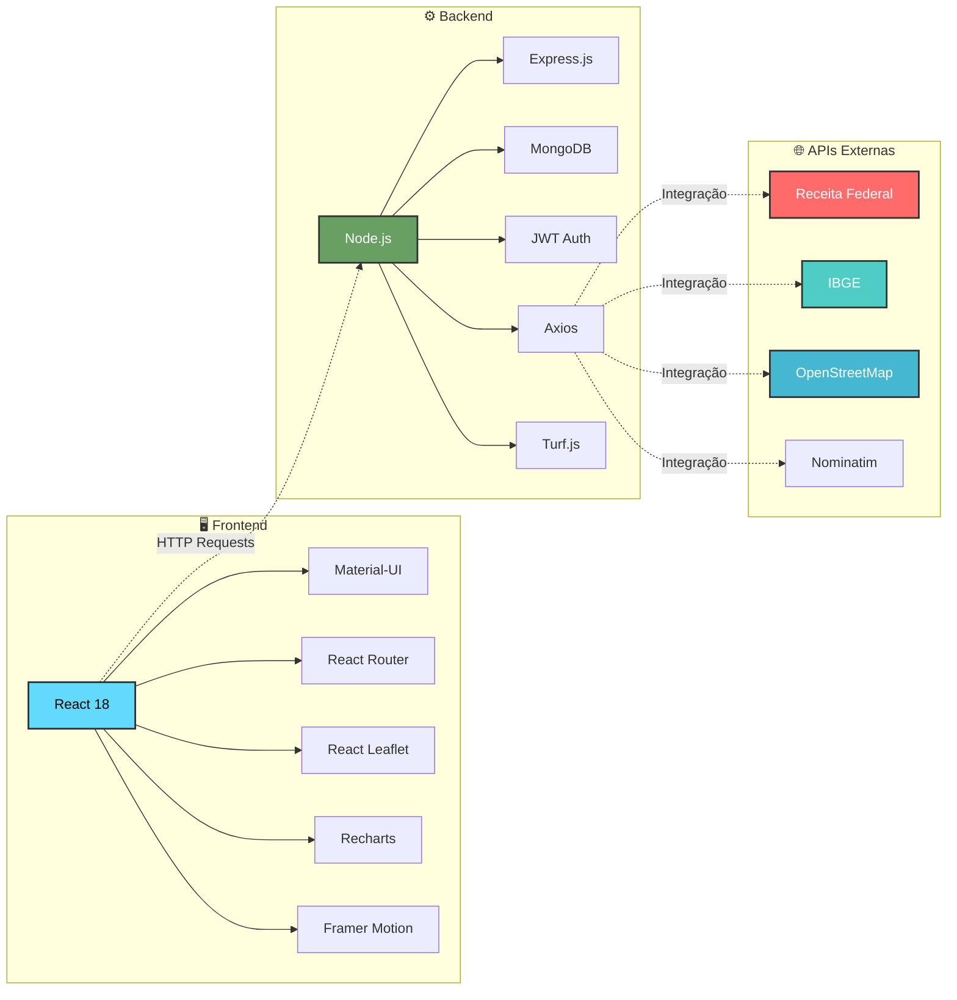

### 🔧 Stack Detalhado

**Backend:**
- **Node.js** com Express.js - Servidor web robusto
- **MongoDB** com Mongoose - Banco de dados NoSQL
- **JWT** para autenticação - Segurança stateless
- **Axios** para integração com APIs - Cliente HTTP
- **Turf.js** para análise geoespacial - Cálculos geográficos

**Frontend:**
- **React 18** com Hooks - Interface moderna e reativa
- **Material-UI (MUI)** para componentes - Design system Google
- **React Router** para navegação - SPA routing
- **React Leaflet** para mapas - Mapas interativos
- **Recharts** para gráficos - Visualização de dados
- **Framer Motion** para animações - Micro-interações

**APIs e Tecnologias de IA:**
- **OpenAI GPT-4** - Assistente conversacional e análise de texto
- **OpenAI Vision** - Análise de imagens e computer vision
- **TensorFlow.js** - Machine learning e predições
- **Receita Federal** - Dados oficiais de empresas (CNPJs)
- **IBGE** - Demografia, censo e estatísticas
- **OpenStreetMap** - Dados geoespaciais via Overpass API
- **Google Places** - Ratings, avaliações e dados comerciais
- **Nominatim** - Geocodificação de endereços

## 🤖 Features de Inteligência Artificial

### 💬 **Assistente IA Conversacional**

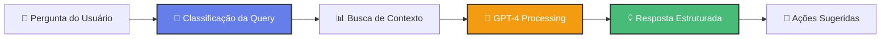

**Tipos de Consulta Suportados:**
- 🏆 **Análise de Concorrência**: "Por que meu CRI está baixo?"
- 🗺️ **Análise de Localização**: "Que POIs complementam meu negócio?"
- 📍 **Recomendação de Local**: "Melhor lugar para pizzaria em SP?"
- 📊 **Interpretação de Scores**: "Como melhorar meu score final?"
- 💡 **Estratégias de Negócio**: "Como competir com concorrentes 5 estrelas?"
- 🏪 **Sugestão de Negócio**: "Que tipo de negócio funciona aqui?"

### 📸 **Análise Visual com Computer Vision**

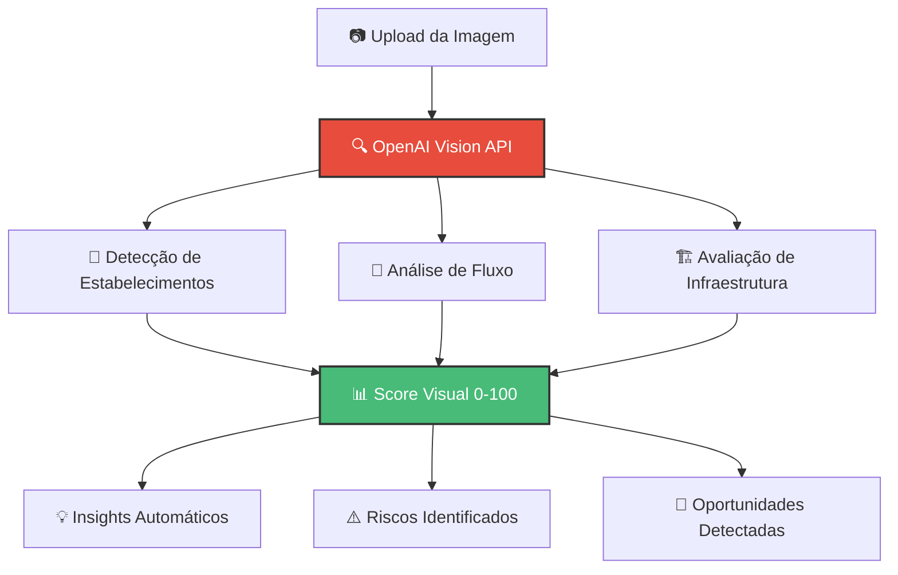

**Capacidades de Análise Visual:**
- 🏪 **Estabelecimentos**: Identificação automática de tipos de negócio
- 🚶 **Densidade de Pessoas**: Análise de movimento e fluxo
- 🏗️ **Infraestrutura**: Qualidade de vias, sinalização, acessibilidade
- 🎯 **Oportunidades**: Gaps de mercado visíveis na imagem
- ⚠️ **Riscos**: Problemas estruturais ou de localização

### 🔮 **Machine Learning Preditivo**

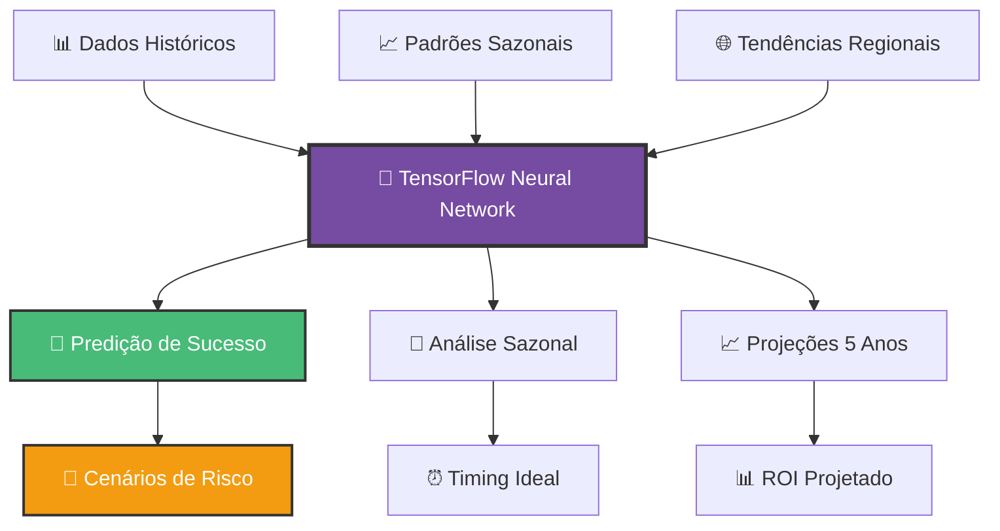

**Predições Disponíveis:**
- 🎯 **Probabilidade de Sucesso**: 0-100% baseado em ML
- 📅 **Sazonalidade**: Melhores e piores meses por tipo de negócio
- 📈 **Tendências de Mercado**: Crescimento, concorrência, custos
- 🎲 **Cenários de Risco**: Otimista (25%), Realista (50%), Pessimista (25%)
- ⏰ **Timing Estratégico**: Melhor época para abertura

## 🧠 Algoritmos Avançados

### 🏆 Competitor Rating Index (CRI)

O **CRI** analisa a qualidade dos concorrentes usando dados do Google Places API:

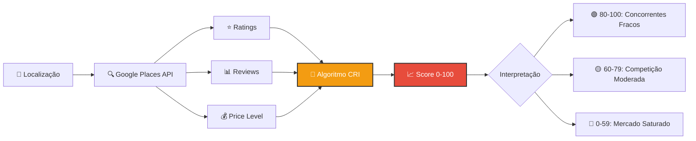

**Fórmula CRI:**
- Score inicial: 100 pontos
- Penalização por quantidade de concorrentes: -5 pontos cada
- Penalização por rating alto (4.5+): -25 pontos
- Penalização por muitas reviews (500+): -20 pontos
- Penalização por concorrentes estabelecidos: -8 pontos cada

### 🗺️ POI Complementarity Score (PCS)

O **PCS** mede a sinergia com pontos de interesse usando OpenStreetMap:

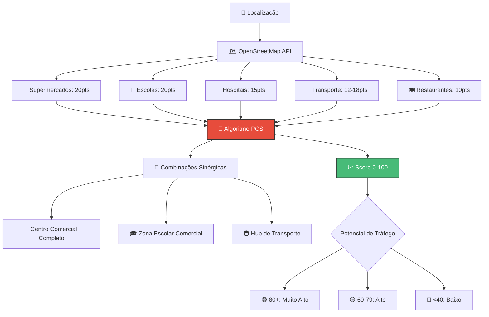

**Fórmula PCS:**
- Pontuação por categoria de POI (máximo 2x valor base)
- Bônus por diversidade: +10-15 pontos
- Bônus por combinações sinérgicas: +8 pontos cada
- Score de acessibilidade: até +25 pontos

## 🌐 Análise Multi-Cidade e Marketplace

### 🏙️ **Comparativo Multi-Cidade**

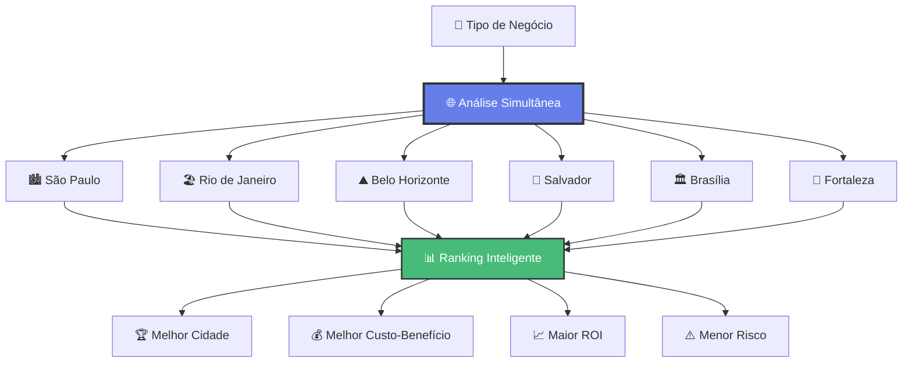

**Métricas Comparativas:**
- 📊 **Score de Viabilidade**: Análise completa por cidade
- 💰 **Investimento Inicial**: Custos estimados por região
- 📈 **ROI Projetado**: Retorno esperado em 12-24 meses
- ⏰ **Payback Period**: Tempo para recuperar investimento
- ⚠️ **Nível de Risco**: Baixo, médio ou alto por localização

### 🤝 **Marketplace de Oportunidades**

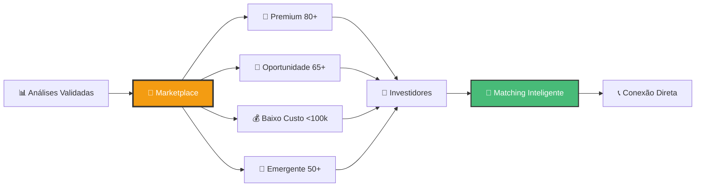

**Categorias do Marketplace:**
- 💎 **Premium**: Oportunidades com score 80+ (alto potencial)
- 🎯 **Oportunidade**: Localizações viáveis com score 65+
- 💰 **Baixo Custo**: Investimento inicial menor que R$ 100k
- 🌱 **Emergente**: Mercados em desenvolvimento (score 50+)

**Sistema de Matching:**
- 🎯 **Perfil do Investidor**: Orçamento, tolerância ao risco, preferências
- 📊 **Score de Compatibilidade**: Algoritmo de matching personalizado
- 🔔 **Alertas Inteligentes**: Notificações de novas oportunidades
- 📈 **Histórico de Performance**: Track record das oportunidades

## 📦 Estrutura do Projeto

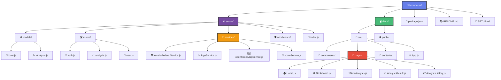

### 🗂️ Estrutura Detalhada

```
bizradar-ai/
├── 📁 server/                 # Backend Node.js + Express
│   ├── 📊 models/            # Esquemas MongoDB (User, Analysis)
│   ├── 🛣️ routes/            # Endpoints da API REST
│   ├── 🔌 services/          # Integrações com APIs externas
│   ├── 🛡️ middleware/        # Auth, rate limiting, validação
│   ├── 🚀 index.js          # Servidor principal Express
│   └── ⚙️ config.env        # Variáveis de ambiente
├── 📁 client/                # Frontend React SPA
│   ├── 📱 src/
│   │   ├── 🧩 components/    # Componentes reutilizáveis (Layout, etc)
│   │   ├── 📄 pages/         # Páginas da aplicação (Home, Dashboard)
│   │   ├── 🔄 contexts/      # Context API (Auth, Analysis)
│   │   ├── ⚛️ App.js        # Componente raiz + roteamento
│   │   └── 🎨 index.css     # Estilos globais
│   ├── 🌐 public/           # Assets estáticos (HTML, ícones)
│   └── 📦 package.json      # Dependências React
├── 📄 package.json          # Scripts principais do projeto
├── 📚 README.md             # Documentação completa
└── 🔧 SETUP.md              # Guia de instalação rápida
```

## 🚀 Como Executar

### Pré-requisitos
- Node.js 16+
- MongoDB
- NPM ou Yarn

### Instalação

1. **Clone o repositório**
```bash
git clone https://github.com/seu-usuario/bizradar-ai.git
cd bizradar-ai
```

2. **Instale as dependências**
```bash
npm run install-all
```

3. **Configure as variáveis de ambiente**
```bash
# Copie e configure o arquivo de ambiente
cp server/config.env server/.env
```

Edite o arquivo `.env` com suas configurações:
```env
PORT=5000
MONGODB_URI=mongodb://localhost:27017/bizradar
JWT_SECRET=seu_jwt_secret_aqui
NODE_ENV=development

# API Keys de IA (essenciais para features avançadas)
OPENAI_API_KEY=sua_chave_openai_gpt4_vision
GOOGLE_PLACES_API_KEY=sua_chave_google_places

# API Keys opcionais (para desenvolvimento)
SERPRO_API_KEY=sua_chave_serpro
IBGE_API_KEY=sua_chave_ibge
MAPBOX_ACCESS_TOKEN=seu_token_mapbox
```

### 🔑 Configuração das APIs

**Google Places API (para CRI):**
1. Acesse [Google Cloud Console](https://console.cloud.google.com/)
2. Crie um projeto ou selecione existente
3. Ative a **Places API**
4. Gere uma API Key
5. Configure restrições (opcional)

**OpenStreetMap (para PCS):**
- ✅ **Gratuito** - Não requer API key
- Usa Overpass API pública
- Rate limit: ~10.000 requests/dia

**Receita Federal & IBGE:**
- ✅ **APIs públicas** - Não requerem autenticação
- Dados oficiais do governo brasileiro

4. **Inicie o MongoDB**
```bash
# No Windows
net start MongoDB

# No macOS/Linux
sudo systemctl start mongod
```

5. **Execute a aplicação**
```bash
# Desenvolvimento (backend + frontend)
npm run dev

# Ou execute separadamente:
npm run server  # Backend na porta 5000
npm run client  # Frontend na porta 3000
```

6. **Acesse a aplicação**
- Frontend: http://localhost:3000
- Backend API: http://localhost:5000

## 📋 Endpoints da API

### 🔐 Autenticação
- `POST /api/auth/register` - Cadastro de usuário
- `POST /api/auth/login` - Login
- `GET /api/auth/me` - Dados do usuário logado
- `PUT /api/auth/profile` - Atualizar perfil

### 📊 Análises Tradicionais
- `POST /api/analysis` - Criar nova análise (com CRI e PCS)
- `GET /api/analysis/:id` - Obter análise específica
- `GET /api/analysis` - Listar análises do usuário
- `DELETE /api/analysis/:id` - Deletar análise
- `GET /api/analysis/:id/export` - Exportar análise
- `GET /api/analysis/:id/cri` - Obter detalhes do CRI
- `GET /api/analysis/:id/pcs` - Obter detalhes do PCS

### 🤖 IA Conversacional
- `POST /api/ai/chat` - Consulta ao assistente IA
- `GET /api/ai/history/:userId` - Histórico de conversas
- `POST /api/ai/sentiment` - Análise de sentimento

### 📸 Análise Visual
- `POST /api/vision/analyze-image` - Análise de foto
- `POST /api/vision/analyze-video` - Análise de vídeo
- `GET /api/vision/history/:userId` - Histórico de análises visuais

### 🌐 Multi-Cidade
- `POST /api/multi-city/compare` - Comparar cidades
- `GET /api/multi-city/cities` - Lista de cidades disponíveis
- `GET /api/multi-city/analysis/:id` - Análise multi-cidade específica

### 🤝 Marketplace
- `GET /api/marketplace/opportunities` - Listar oportunidades
- `POST /api/marketplace/opportunities` - Criar oportunidade
- `GET /api/marketplace/opportunities/:id` - Oportunidade específica
- `POST /api/marketplace/interest` - Demonstrar interesse
- `GET /api/marketplace/my-opportunities/:userId` - Minhas oportunidades

### 🔮 Análise Preditiva
- `POST /api/predictive/success` - Predição de sucesso
- `POST /api/predictive/seasonal` - Análise sazonal
- `POST /api/predictive/market-trends` - Tendências de mercado

### 📊 Dashboard Executivo
- `GET /api/dashboard/kpis` - KPIs globais
- `GET /api/dashboard/user-metrics/:userId` - Métricas do usuário
- `GET /api/dashboard/market-trends` - Tendências de mercado
- `GET /api/dashboard/alerts/:userId` - Alertas e notificações

### 👤 Usuário
- `GET /api/user/subscription` - Informações da assinatura
- `PUT /api/user/subscription/upgrade` - Fazer upgrade do plano
- `GET /api/user/usage` - Estatísticas de uso

## 💰 Modelo de Negócio

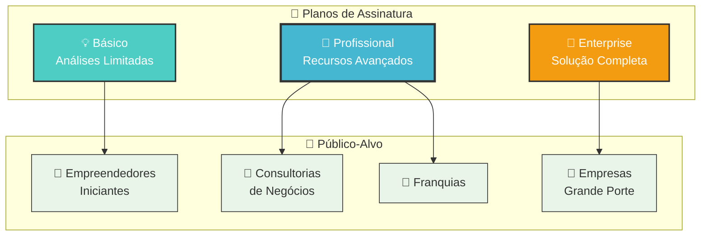

### 📊 Comparativo de Planos

| Funcionalidade | Básico | Profissional | Enterprise |
|---|:---:|:---:|:---:|
| **💰 Modelo** | Por análise | Assinatura mensal | Sob medida |
| **📊 Análises** | Limitadas | ♾️ Ilimitadas | ♾️ Ilimitadas |
| **🗺️ Mapeamento** | ✅ Básico | ✅ Completo | ✅ Avançado |
| **📈 Demografia** | ✅ Básica | ✅ Avançada | ✅ Personalizada |
| **🎯 Sugestões** | ❌ | ✅ Localizações | ✅ + Estratégias |
| **🚌 Transporte** | ❌ | ✅ | ✅ |
| **📄 Exportação** | ❌ | ✅ PDF/Excel | ✅ + Formatos |
| **🔌 API** | ❌ | ✅ | ✅ + Webhooks |
| **📞 Suporte** | 📧 Email | 🚀 Prioritário | 🌟 24/7 |
| **👥 Consultoria** | ❌ | ❌ | ✅ Especializada |

### 🎯 Segmentação de Mercado

**💡 Básico**
- 🎯 Empreendedores iniciantes
- 📊 Análises pontuais
- 🏪 Pequenos negócios locais
- 📧 Suporte por email

**🚀 Profissional - MAIS POPULAR**
- 🎯 Consultorias e corretores
- ♾️ Análises ilimitadas
- 🔌 API para integração
- 🚀 Suporte prioritário

**🏢 Enterprise**
- 🎯 Grandes empresas e franquias
- 📊 Análises em lote
- 👨‍💼 Consultoria especializada
- 🌟 Suporte 24/7 + SLA

## 🔧 Desenvolvimento

### Scripts Disponíveis
```bash
npm run dev          # Executa backend + frontend
npm run server       # Executa apenas o backend
npm run client       # Executa apenas o frontend
npm run build        # Build de produção
npm run start        # Executa em produção
npm run install-all  # Instala todas as dependências
```

### Estrutura de Dados

**Usuário**
```javascript
{
  name: String,
  email: String,
  password: String (hash),
  plan: 'individual' | 'pro' | 'enterprise',
  subscription: {
    status: 'active' | 'inactive' | 'trial',
    analysisCount: Number,
    analysisLimit: Number
  }
}
```

**Análise**
```javascript
{
  userId: ObjectId,
  businessType: String,
  cnae: String,
  location: {
    address: String,
    coordinates: { lat: Number, lng: Number }
  },
  competitors: {
    formal: [Competitor],
    informal: [Competitor],
    google: [GooglePlaceCompetitor] // Novo: dados do Google Places
  },
  demographics: DemographicData,
  scores: {
    saturation: { value: Number, level: String },
    opportunity: { value: Number, level: String },
    competitorRating: { // Novo: CRI Score
      score: Number,
      level: String,
      analysis: {
        total_competitors: Number,
        avg_rating: Number,
        avg_reviews: Number,
        high_quality_competitors: Number,
        market_saturation: String
      }
    },
    poiComplementarity: { // Novo: PCS Score
      score: Number,
      level: String,
      analysis: {
        traffic_generators: [Object],
        complementary_businesses: [String],
        accessibility_score: Number,
        foot_traffic_potential: String
      }
    },
    final: { value: Number, probability: String }
  },
  insights: [Insight], // Expandido com insights de CRI e PCS
  status: 'processing' | 'completed' | 'error',
  createdAt: Date,
  updatedAt: Date
}
```

## 🧪 Testes

```bash
# Testes do backend
cd server && npm test

# Testes do frontend
cd client && npm test
```

## 📈 Deploy

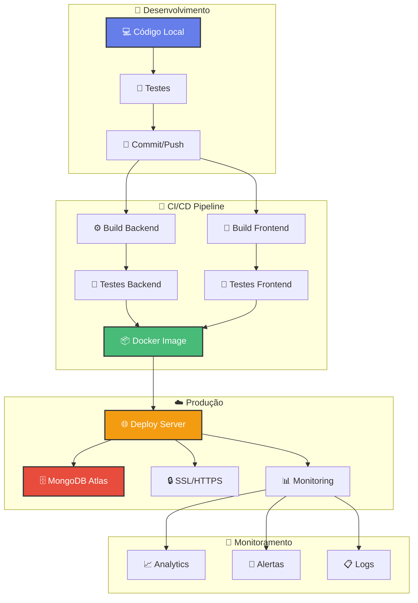

### 🚀 Processo de Deploy

**1. 🔧 Preparação**
```bash
# Build do frontend
npm run build

# Configurar variáveis de ambiente
cp server/config.env server/.env
```

**2. 🐳 Docker (Recomendado)**
```bash
# Build da imagem
docker build -t bizradar-ai .

# Execute o container
docker run -p 5000:5000 bizradar-ai
```

**3. ☁️ Deploy em Produção**
- **Frontend**: Vercel, Netlify ou AWS S3
- **Backend**: Heroku, Railway ou AWS EC2
- **Banco**: MongoDB Atlas (cloud)
- **CDN**: Cloudflare para performance

**4. 📊 Monitoramento**
- **Uptime**: UptimeRobot
- **Performance**: New Relic ou DataDog
- **Logs**: LogRocket ou Sentry
- **Analytics**: Google Analytics + Mixpanel

## 🤝 Contribuição

1. Fork o projeto
2. Crie uma branch para sua feature (`git checkout -b feature/AmazingFeature`)
3. Commit suas mudanças (`git commit -m 'Add some AmazingFeature'`)
4. Push para a branch (`git push origin feature/AmazingFeature`)
5. Abra um Pull Request

## 📄 Licença

Este projeto está sob a licença MIT. Veja o arquivo [LICENSE](LICENSE) para mais detalhes.

## 🏆 Funcionalidades Implementadas

### 🔐 **Core System**
- ✅ **Sistema de Autenticação** (JWT + Context API)
- ✅ **Dashboard Interativo** (Estatísticas + Gráficos)
- ✅ **Interface Responsiva** (Mobile + Desktop)
- ✅ **Sistema de Planos** (Básico, Profissional, Enterprise)

### 🤖 **Inteligência Artificial Avançada**
- ✅ **Assistente IA Conversacional** (ChatGPT-4 integrado)
- ✅ **Análise Visual com Computer Vision** (OpenAI Vision API)
- ✅ **Machine Learning Preditivo** (TensorFlow.js)
- ✅ **Análise de Sentimento** (Para métricas de satisfação)
- ✅ **Processamento de Linguagem Natural** (7 tipos de consulta)

### 🌐 **Análise Multi-Dimensional**
- ✅ **Comparativo Multi-Cidade** (10+ cidades brasileiras)
- ✅ **Marketplace de Oportunidades** (4 categorias de investimento)
- ✅ **Análise Preditiva** (Cenários de 5 anos)
- ✅ **Dashboard Executivo** (15+ KPIs em tempo real)
- ✅ **Alertas Inteligentes** (Notificações automáticas)

### 🧠 **Algoritmos Proprietários**
- ✅ **Motor de Score Avançado** (6 fatores ponderados)
- ✅ **CRI - Competitor Rating Index** (Google Places API)
- ✅ **PCS - POI Complementarity Score** (OpenStreetMap)
- ✅ **Análise de Saturação** (Densidade vs. População)
- ✅ **Insights Inteligentes** (15+ tipos de recomendações)

### 🗺️ **Análise Geoespacial**
- ✅ **Mapas Interativos** (Leaflet + Camadas dinâmicas)
- ✅ **Mapeamento 360°** (Formais + Informais + Ratings)
- ✅ **Análise de Mobilidade** (Transporte público)
- ✅ **Sinergia Comercial** (POIs complementares)
- ✅ **Análise Visual de Localização** (Upload de fotos)

### 📊 **Data & Analytics**
- ✅ **Histórico de Análises** (Filtros + Exportação)
- ✅ **Relatórios Avançados** (PDF/JSON com CRI e PCS)
- ✅ **APIs Integradas** (4 fontes de dados)
- ✅ **Cache Inteligente** (Performance otimizada)

### 🛠️ **Desenvolvimento**
- ✅ **Dados Mock Realistas** (Para demonstração)
- ✅ **Fallback Systems** (Funcionamento sem APIs)
- ✅ **Documentação Completa** (README + Setup)
- ✅ **Arquitetura Escalável** (Microserviços)


**🚀 BizRadar AI - Análise Inteligente de Negócios**

</div>
